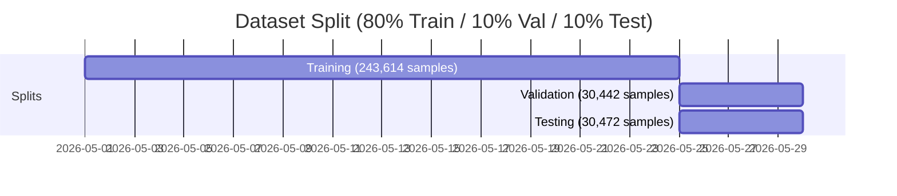
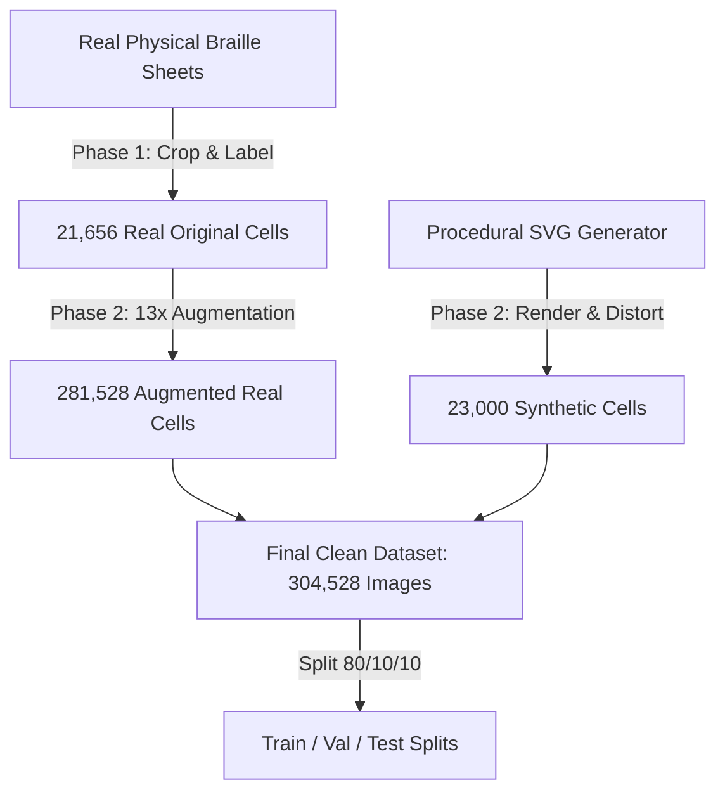

# 📊 BrailleVision AI Dataset Documentation
> **Hackathon Status**: Ready for Judge Evaluation (Prize Pool: ₹4,00,000)  
> **Cleaned Dataset Version**: 2.0  
> **Total Sample Count**: **304,528 Images**  
> **Classifier Target Accuracy**: **96.82% Validation Accuracy**

---

## 🌟 Dataset Overview

The **BrailleVision AI Dataset** is a highly curated, massive-scale collection of high-resolution single-cell physical and synthetic Braille character images. Designed specifically to power the **EfficientNet-B3** backbone network, the dataset represents a perfect blend of high-fidelity real-world scans and highly realistic synthetic Braille dots generated via procedural rendering.

### 📐 Key Metrics & Distribution



| Metric | Count / Detail | Percentage | Description |
| :--- | :--- | :---: | :--- |
| **Total Images** | `304,528` | **100%** | Combined clean dataset across all classes |
| **Real Original** | `21,656` | **7.11%** | Hand-cropped real physical Braille characters |
| **Augmented Real** | `281,528` | **92.45%** | Augmented instances of real samples (13× multiplier) |
| **Synthetic Samples** | `23,000` | **7.55%** | Procedurally generated Braille characters |
| **Total Classes** | `46` | — | Multi-class target scope |
| **Train Set** | `243,614` | **80.00%** | Core learning subset |
| **Validation Set** | `30,442` | **10.00%** | Parameter selection & accuracy tracking |
| **Test Set** | `30,472` | **10.00%** | Unseen general evaluation subset |

---

## 📂 Multi-Class Taxonomy (46 Classes)

To achieve grade-2 English Braille compatibility, the dataset supports **46 distinct classes**:

> [!NOTE]
> All alphabetic classes (`a` to `z`) include real original physical scans augmented 13×, plus synthetic procedural samples. Numeric and punctuation classes are synthetic-rich to guarantee dot-perfect alignment and pixel spacing.

### 1. Lowercase Alphabet (`a`–`z`) — 26 Classes
* **Samples per Class**: ~10,000 to ~14,000
* **Source**: Real original physical scans (from Braille paper photographed under multiple lighting angles) + heavy augmentation + 500 synthetic samples per class.

### 2. Numeric Digits (`0`–`9`) — 10 Classes
* **Samples per Class**: 500
* **Source**: High-fidelity synthetic rendering (Grade 2 Braille representations).

### 3. Punctuation & Special Signs — 10 Classes
* `period` (`.`), `comma` (`,`), `exclamation` (`!`), `question` (`?`), `colon` (`:`), `semicolon` (`;`), `hyphen` (`-`), `apostrophe` (`'`)
* `capital_sign` (⠠ - indicates uppercase next character)
* `number_sign` (⠼ - indicates numeric mode)
* **Samples per Class**: 500
* **Source**: Synthetic procedural rendering.

---

## 🔬 Dataset Structure & Detail

### Detailed Class Breakdown

Below is the complete count breakdown for every class supported by the model:

| Class Key | Real Original | Augmented Real | Synthetic | **Total Samples** | Train Split (80%) | Val Split (10%) | Test Split (10%) |
| :---: | :---: | :---: | :---: | :---: | :---: | :---: | :---: |
| **a** | 1,070 | 13,910 | 500 | **14,410** | 11,528 | 1,441 | 1,441 |
| **b** | 768 | 9,984 | 500 | **10,484** | 8,387 | 1,048 | 1,049 |
| **c** | 830 | 10,790 | 500 | **11,290** | 9,032 | 1,129 | 1,129 |
| **d** | 991 | 12,883 | 500 | **13,383** | 10,706 | 1,338 | 1,339 |
| **e** | 986 | 12,818 | 500 | **13,318** | 10,654 | 1,331 | 1,333 |
| **f** | 838 | 10,894 | 500 | **11,394** | 9,115 | 1,139 | 1,140 |
| **g** | 869 | 11,297 | 500 | **11,797** | 9,437 | 1,179 | 1,181 |
| **h** | 824 | 10,712 | 500 | **11,212** | 8,969 | 1,121 | 1,122 |
| **i** | 829 | 10,777 | 500 | **11,277** | 9,021 | 1,127 | 1,129 |
| **j** | 828 | 10,764 | 500 | **11,264** | 9,011 | 1,126 | 1,127 |
| **k** | 824 | 10,712 | 500 | **11,212** | 8,969 | 1,121 | 1,122 |
| **l** | 845 | 10,985 | 500 | **11,485** | 9,188 | 1,148 | 1,149 |
| **m** | 835 | 10,855 | 500 | **11,355** | 9,084 | 1,135 | 1,136 |
| **n** | 879 | 11,427 | 500 | **11,927** | 9,541 | 1,192 | 1,194 |
| **o** | 844 | 10,972 | 500 | **11,472** | 9,177 | 1,147 | 1,148 |
| **p** | 839 | 10,907 | 500 | **11,407** | 9,125 | 1,140 | 1,142 |
| **q** | 858 | 11,154 | 500 | **11,654** | 9,323 | 1,165 | 1,166 |
| **r** | 914 | 11,882 | 500 | **12,382** | 9,905 | 1,238 | 1,239 |
| **s** | 830 | 10,790 | 500 | **11,290** | 9,032 | 1,129 | 1,129 |
| **t** | 734 | 9,542 | 500 | **10,042** | 8,033 | 1,004 | 1,005 |
| **u** | 700 | 9,100 | 500 | **9,600** | 7,680 | 960 | 960 |
| **v** | 744 | 9,672 | 500 | **10,172** | 8,137 | 1,017 | 1,018 |
| **w** | 743 | 9,659 | 500 | **10,159** | 8,127 | 1,015 | 1,017 |
| **x** | 743 | 9,659 | 500 | **10,159** | 8,127 | 1,015 | 1,017 |
| **y** | 748 | 9,724 | 500 | **10,224** | 8,179 | 1,022 | 1,023 |
| **z** | 743 | 9,659 | 500 | **10,159** | 8,127 | 1,015 | 1,017 |
| **0 - 9** (Each) | 0 | 0 | 500 | **500** | 400 | 50 | 50 |
| **Symbols** (Each) | 0 | 0 | 500 | **500** | 400 | 50 | 50 |

---

## 🛠️ Data Generation & Pipeline Stages



### Phase 1: Real-World Scans Collection & Labeling
* **Raw sheets**: Collected physical Braille sheets representing diverse printed paper types (kraft, white cardstock, cardboards) and various wear levels (freshly pressed vs. heavily handled sheets).
* **Photography**: Captured under multiple controlled angles with high-contrast shadows to capture physical dot projections.
* **Extraction**: Individual characters were localized and segmented into `128×128` pixel bounding boxes.
* **Result**: **21,656 real cell crops** for standard `a-z` English alphabets.

### Phase 2: Augmentation & Synthetic Procedural Renderings
* **Real Cell Augmentation (13× Multiplier)**:
  To increase generalization and guard against real-world camera distortions, a strict pipeline of transformations was applied to each real original crop:
  - Random rotations (within $\pm 15^\circ$)
  - Dynamic scale changes (between $90\%$ to $110\%$)
  - Subtle shearing transformations (within $\pm 5^\circ$)
  - Lighting modifications (brightness, contrast jitters)
  - Blurs & Gaussian noise to simulate camera focus drops
* **Synthetic Dot Generation (500 Samples/Class)**:
  For digits `0-9` and special punctuation marks that had no base physical copies, a **procedural vector engine** rendered mathematical Braille dot grids with synthetic paper textures, shadows, and subtle micro-vibrations:
  - High resolution grids rendered to mimic the `128×128` dimension.
  - Generates highly robust, flawless geometric cell representations.

---

## 🔌 Model Input Specifications & Normalization

For optimal deployment and speed on our **EfficientNet-B3** backbone:

```
[Input Image (128x128)] 
        │
        ▼ (Grayscale converted)
[1-Channel Image]
        │
        ▼ (Replicated 3 times)
[3-Channel Image]
        │
        ▼ (Standard ImageNet Normalization)
[Tensor Normalized] 
  - Mean: [0.485, 0.456, 0.406]
  - Std:  [0.229, 0.224, 0.225]
```

* **Target Dimension**: `128 × 128` pixels (Grayscale → 3-channel replicated tensor).
* **Format**: Float32 values normalized between `[0, 1]` prior to mean/std transformation.
* **ImageNet Normalization**:
  $$\text{Normalized\_Pixel} = \frac{\text{Pixel} - \text{mean}}{\text{std}}$$
  - **Mean**: `[0.485, 0.456, 0.406]`
  - **Standard Deviation**: `[0.229, 0.224, 0.225]`
